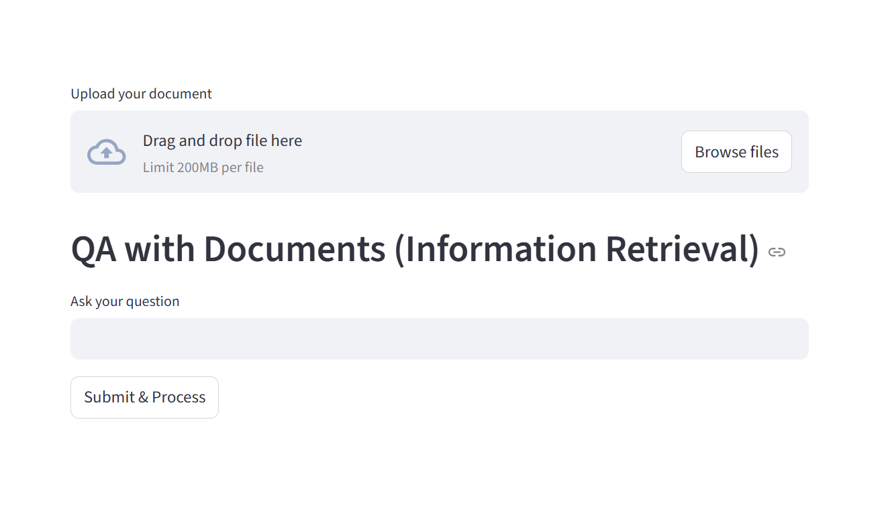
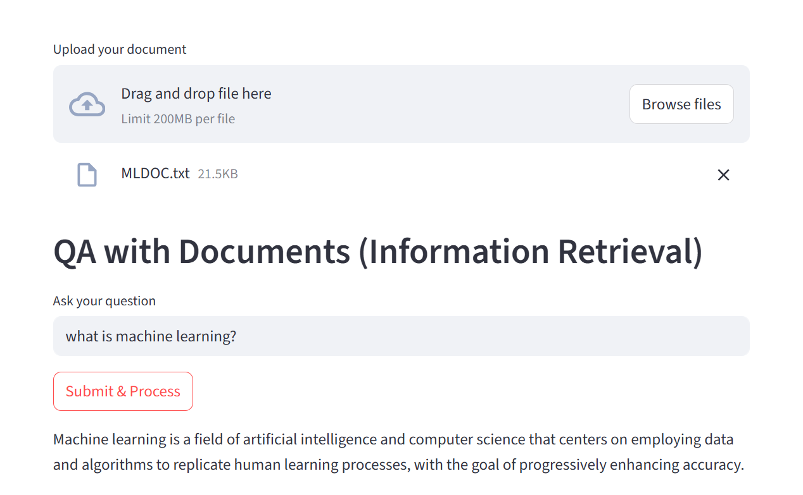

Here's a **complete `README.md` file** for your `QA_System` project based on what you've shared (Gemini integration, document-based QA using Streamlit and LlamaIndex):

---

````markdown
# QA_System 🧠📄  
**Question Answering System using Gemini and LlamaIndex**

This is a document-based QA system that lets you upload your PDF and ask natural language questions to extract information from it. It uses **Gemini (Google's LLM)** as the backend, along with **LlamaIndex** for indexing and querying the document. The frontend is built using **Streamlit**.

---

## 🚀 Features

- ✅ Upload PDF documents
- ✅ Ask natural language questions
- ✅ Uses Gemini Pro (`gemini-1.5-flash-latest`) as the LLM
- ✅ Indexes documents using LlamaIndex
- ✅ Clean, minimal Streamlit interface

---

## 🧰 Tech Stack

- **Python 3.8+**
- **Streamlit**
- **LlamaIndex**
- **Gemini LLM via Google Generative AI**
- **dotenv (for secrets handling)**

---

## 📦 Installation

### 1. Clone the repository

```bash
git clone https://github.com/Jagritimaurya82/QA_SYSTEM.git
cd QA_SYSTEM
````

### 2. Create a virtual environment (optional but recommended)

```bash
python -m venv venv
source venv/bin/activate  # or venv\Scripts\activate on Windows
```

### 3. Install dependencies

```bash
pip install -r requirements.txt
```

---

## 🔑 Setup API Keys

Create a `.env` file in the root directory and add your Gemini API key:

```env
GOOGLE_API_KEY=your_gemini_api_key_here
```

> You can get your Gemini API key from [Google AI Studio](https://makersuite.google.com/app).

---

## ▶️ Run the App

```bash
streamlit run StreamlitApp.py
```

The app will open in your default browser.

---

## 🗃️ Project Structure

```
QA_SYSTEM/
├── app.py                      # Streamlit UI
├── requirements.txt
├── .env                        # Gemini API Key (not committed)
├── logs/                       # App logs
├── Data/                       # Folder where PDFs are uploaded
├── QAWithPDF/
│   ├── data_ingestion.py      # Loads and parses PDFs
│   ├── embedding.py           # Embeds documents using Gemini + LlamaIndex
│   ├── model_api.py           # Loads the Gemini model
├── exception.py               # Custom exception handler
├── logger.py                  # Logging setup
```

---

## 📸 Screenshots



> Upload document



> Ask questions and get accurate answers

---

## ⚠️ Note

* Only PDF file support is implemented.
* Gemini LLMs require internet and valid API key.
* Model used: `gemini-1.5-flash-latest` (changeable in `model_api.py`)

---
 
